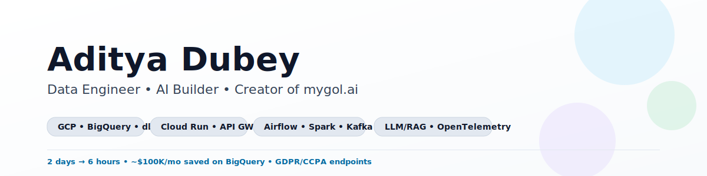
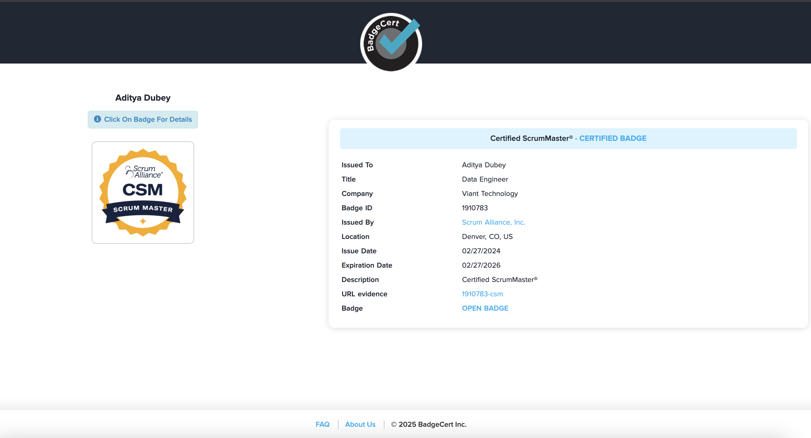
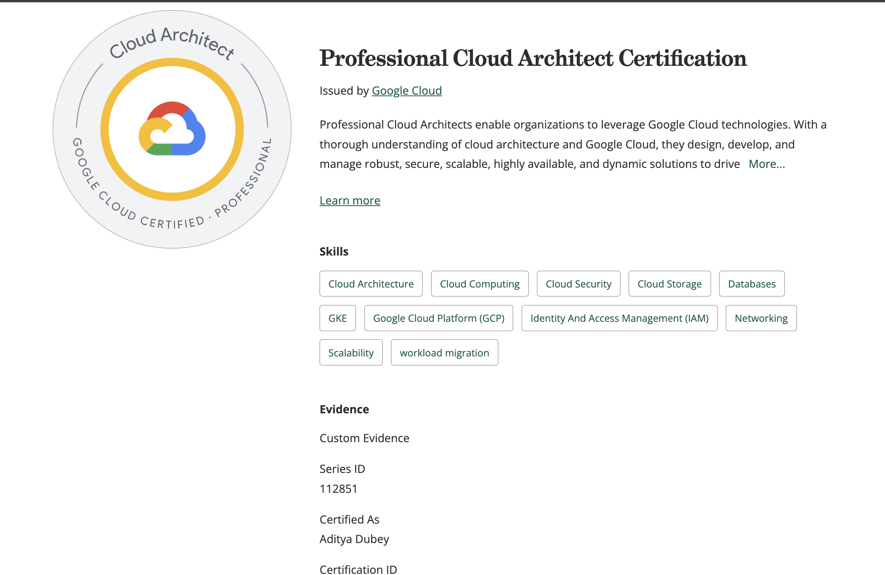

<!-- Polished GitHub Profile README for Ps-budd -->

  <picture>
    <source media="(prefers-color-scheme: dark)" srcset="assets/banner_dark.svg" />
    
  </picture>

<h1 align="center">Aditya Dubey</h1>

<b>Data Engineer · Cloud Architect · AI Builder · Creator of mygol.ai</b>

  

  
  
  
  
  

  
  Innovative Data Engineer with 5+ years building cloud‑native data platforms and privacy‑first APIs on GCP/AWS/Snowflake. Led cost and latency wins including <b>$100K/month</b> BigQuery savings and <b>87%</b> delivery‑SLA reduction. I ship observable, scalable systems and pragmatic LLM/RAG features with guardrails.

---

### 🚀 What I’m focused on
- Cloud‑native data platforms on <b>GCP</b> (Cloud Run, Dataflow, Pub/Sub, BigQuery, dbt, Airflow, Spark)
- Privacy‑first APIs (GDPR/CCPA), observability with OpenTelemetry, and async event pipelines
- AI features: LLM/RAG, evals and hallucination mitigation for production reliability
- Now building: <b>mygol.ai</b> — an automated job‑apply engine on Cloud Run + Next.js

---

### 🏅 Certifications

  
  &nbsp;&nbsp;
  

---

### 🧩 Featured builds
- <b>First‑Party Segment API (GCP)</b> — Cloud Run + API Gateway + Pub/Sub/Dataflow; OpenTelemetry tracing; opt‑out & expiration endpoints.  
  Stack: `GCP` · `Cloud Run` · `API Gateway` · `BigQuery` · `OpenTelemetry`

- <b>CRM Delivery Platform</b> — PII encryption/salting; SFTP/GCS/S3 <b>chunked delivery</b> with retries; <b>2 days → 6 hours</b>.

- <b>LLM Audience Segmenter</b> — NL → audience segments; <b>90%</b> manual effort ↓; <b>85%</b> launch time ↓; guardrails + evals.  
  Stack: `FastAPI` · `OpenAI/Gemini` · `Guardrails` · `Evals`

- <b>BigQuery Cost Optimizer</b> — stored procedures + usage analyzer; partition/prune; <b>~$100K/month</b> saved.

---

### 🔧 Toolbox

  
  
  
  
  
  
  
  
  
  
  
  
  
  
  
  
  
  
  
  
  
  

---

### 📈 GitHub at a glance

  
  

---

### 📬 Get in touch
- Email: <a href="mailto:adi.dubey552@gmail.com">adi.dubey552@gmail.com</a>
- LinkedIn: <a href="https://www.linkedin.com/in/adityadubey09/" target="_blank">adityadubey09</a>
- Resume: <a href="assets/Aditya_Dubey_Resume.pdf" target="_blank">PDF</a>

Always happy to chat about data platforms, cloud, and productionizing AI.
